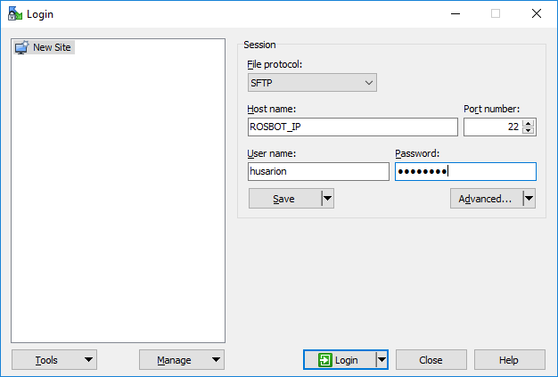
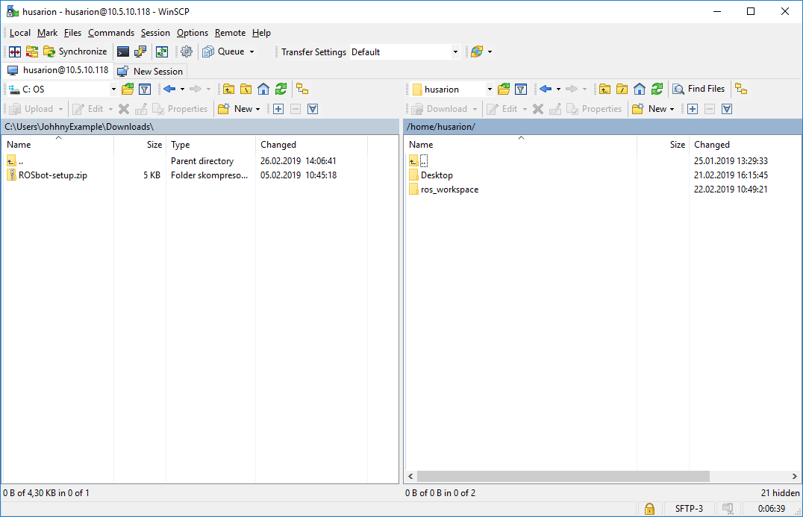
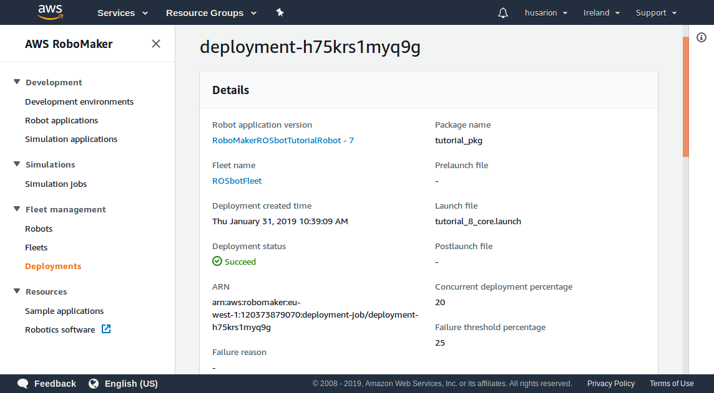
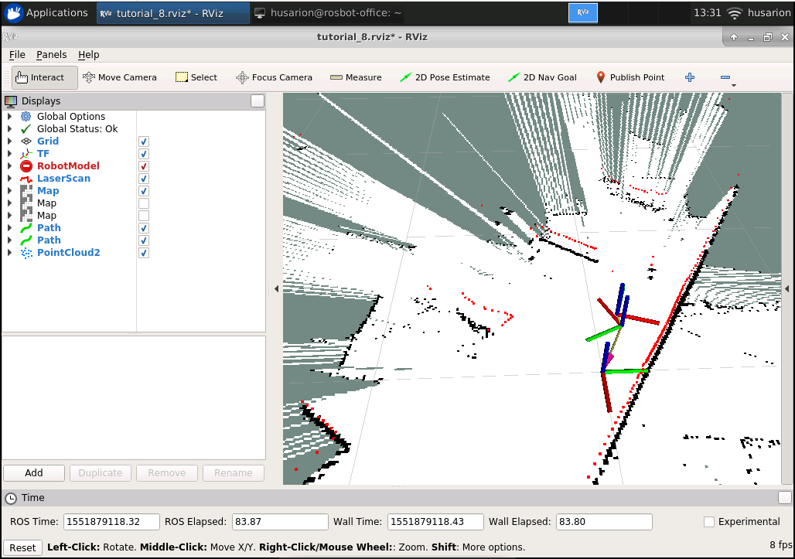

# ROSbot - quick start #

ROSbot 2.0 is autonomous, open source robot platform. It can be used as a learning platform for Robot Operating System as well as a base for a variety of robotic applications such as research robots, inspection robots, custom service robots etc.

## Unboxing ##

What's in the box:

* carrying case
* ROSbot 2.0 (with optional 3D camera and LiDAR already assembled)
* Wi-Fi 2.4GHz antenna
* 3x 18650 Li-Ion reachargeable batteries
* universal charger with power adapter
* charging cable
* microSD card with the software for ROSbot
* USB to Ethernet adapter

<div><center></center></div>

## Rear panel discription ##

In the picture below you can see names of the elements from the rear panel of the ROSbot.


## Assembly ##

Your ROSbot is assembled, but to get it ready to work, you need to provide a power supply and attach the antenna. 

To mount the batteries follow these steps:

* turn ROSbot upside down
* unscrew battery cover mounted with two screws

* remove the battery cover

* place batteries accordingly to the symbols, keeping the black strip under the batteries

* place batery cover and mount it with screws


## Quick start charging guide ##

1. Connect the power adapter to the charger and the output cable between charger and ROSbot (2 connectors on charger side, 1 black connector to ROSbot charging port).


After this step is complete your charger should look like this:


2. Use the first two buttons to select “LiPo BATT” mode and press [Start] button.
3. Use arrows to select “LiPo CHARGE” mode.
4. Press [Start] - the current value should start blinking. Use arrows to set the current to 1.5A. 
5. Press [Start] again - the voltage value should start blinking. Select “11.1V(3S)” using arrows.
6. Press and hold [Start] for 2 seconds. The charger should now ask for confirmation. Press [Start] again. The charging process should begin now.
7. When charging is finished (after about 3 hours), the charger will generate a loud “beep” sound and will finish charging at the same time.

The picture below is a visualization of the mentioned steps.


To attach the antenna, screw it to the antenna connector on the ROSbot rear panel.


After assembly it should look like this.


## Connecting to the cloud ##

Before you start using the platform you need to create a [Husarion Cloud](https://cloud.husarion.com) account. 
Now let's connect the ROSbot to [Husarion Cloud](https://cloud.husarion.com).  

### Connecting using mobile device and browser ###

Before you perform the next steps, install the hConfig mobile application on your smartphone or tablet:
* [Google Play](https://play.google.com/store/apps/details?id=com.husarion.configtool2&hl=en)
* [AppStore](https://itunes.apple.com/us/app/hconfig/id1283536270?mt=8)

1\. Open hConfig app on your smartphone and follow the wizard that will show you how to connect CORE2 (the controller that is inside the ROSBot) to your Wi-Fi network and your Husarion cloud account. The phone is required only once for configuration and connecting CORE2 with cloud. After that step is complete you will not be using it. After you select the Wi-Fi network for your CORE2 in the hConfig app, you can proceed to the next steps.

The WiFi bradcasted by CORE2 controller can be used only for configuration, it does not allow to connect to the internet. Your phone may show warning regarding no internet connection while connected to this WiFi. You can ignore these warnings, as this will not interrupt the process.

<b>For Android users: turn off mobile internet on your smartphone while using hConfig app </b>

2\. hConfig app will ask you to add a new device. Open https://cloud.husarion.com in your browser and sign in.


3\. Click "Add new device".


4\. Enter the name for your ROSbot.


5\. Scan QR code using the hConfig app.


6\. Well done! You just added your robot to the cloud!


## Getting the device IP

Click "+" next to your device name and select "IDE".


Click "More" button to open device details view.

Find line `Local IP` and note address provided, we will refer to it later as `ROSBOT_IP`.

## Programming a firmware ##

First you will program the ROSbot:

Click "+" next to your device name and select "IDE".


Click "Create" button to open new project wizard.


Select CORE2 board, chose "ROSbot default firmware" project template and enter name, eg. myROSbot, and click "Create project" button.


This is a web Integrated Development Environment in which you can write a firmware for your device, and upload the firmware through the Internet.


Click `<none>` (eipse on image) next to `selected device` and select `myFirstDev` device.

Click a button with a `cloud with arrow` (red square on image) to upload new firmware to your device. Well done! now you can check how your first program works.


In the previous step you have uploaded the firmware into your ROSbot. Let's check how it works!<br/>

# RoboMaker ROSbot project #

This project contains ROSbot model along with launch files required to launch [Husarion ROS tutorials](https://husarion.com/tutorials/) on [AWS RoboMaker](https://aws.amazon.com/robomaker/) and deploy them to ROSbot with use of Greengrass.
Currently, tutorials [6 - SLAM navigation](https://husarion.com/tutorials/ros-tutorials/6-slam-navigation/), [7 - Path planning](https://husarion.com/tutorials/ros-tutorials/7-path-planning/) and [8 - Unknown environment exploration](https://husarion.com/tutorials/ros-tutorials/8-unknown-environment-exploration/) are tested, other tutorials will be added soon.


#### Configure AWS Environment
Before we use AWS RoboMaker to build and deploy the tutorial applications, we must first set up the AWS environment.  To simplify the configuration, we will use AWS CloudFormation.  CloudFormation enables us to use a template file to define the configuration of our environment.  We will use CloudFormation to create a bucket in Amaazon S3, as well as to create the necessary permissions in AWS Identity and Access Manager (IAM) that AWS RoboMaker requires to simulate and deploy our robot appliations.

To deploy the template, sign in to the [CloudFormation console](https://console.aws.amazon.com/cloudformation/).  Following the following steps to deploy the template:
1.  Download the template file from [here](rosbot_tutorial_template.yaml).
2.  Click the **Create Stack** button.
3.  Under *Choose a template*, choose *Upload a template to Amazon S3* and click **Choose File**.
4.  Browse to the rosbot_tutorial_template.yaml file you download in Step 1 above.
5.  Click **Next**.
6.  On the next screen, provide a *Stack name*.  This should be something descriptive such as "ROSbot-setup".
7.  In the *S3BucketName* field, provide a globally-unique name for the S3 bucket that will be created.  This S3 bucket will be used to store your robot application bundles, as well as any logs that your robot may generate during simulation.  Use a name unique to you, such as "&lt;user_id&gt;-rosbot-tutorial".  Replace "&lt;user-id&gt;" with a unique string.
8.  Choose **Next**.
9.  On the Options page, leave all defaults and choose **Next**.
10.  On the Review page, click the checkbox to acknowledge that CloudFormation will create IAM resources on your behalf.
11.  Click **Create**.

After a few brief minutes, the stack will be created.  When the status has changed to CREATE_COMPLETE, choose the stack you just created, and view its Outputs.  You will see 3 key/value pairs.  You will use these values later in this guide.

#### ROSbot setup in RoboMaker

ROSbot need some system modifications before Greengrass will be able to run and deploy applications. To configure ROSbot:
- sign in to the AWS RoboMaker [console](https://console.aws.amazon.com/robomaker/)
- In the left navigation pane, choose **Fleet Management** and then choose **Robots**.


- Choose **Create robot*.
- In the **Name** field, type `ROSbot`.
- From the **Architecture** dropdown menu choose **ARMHF**.
- From the **AWS Greengrass group** dropdown menu choose **Create new**.
- In the **AWS Greengrass prefix** field type `ROSbot`
- In the **IAM role** select **ROSbot-deployment-role**


- Proceed with **Create**, you will be redirected to **Download your Core device** page.


- Choose **Download** button next to **Download and store your Core's security resources**

- You will get `ROSbot-setup.zip` file, it need to be uploaded to ROSbot. The upload process will vary, depending on your host operating system.

##### On Linux

Navigate to directory where the file is downloaded, by default it should be `~/Downloads`

```
cd ~/Downloads
```

- Copy the file to your ROSbot, you will need to substitute `ROSBOT_IP` with device address you noted earlier:

```
scp ROSbot-setup.zip husarion@ROSBOT_IP:ROSbot-setup.zip
```

##### On Windows

You will need an SCP client, download and install [WinSCP](https://winscp.net/eng/download.php).

Start WinSCP, you will see the login dialog:



- From `File protocol` dropdown menu choose: `SFTP`.
- In `Host name` field provide rosbot IP address that you noted earlier, it is the value which we described as `ROSBOT_IP`.
- In `Port number` field provide `22`.
- In `User name` field provide `husarion`.
- In `Password` field provide `husarion`.

When all fields are filled up,  click `Login` button to connect, you will see file manager view.



In the left tab navigate to directory where you downloaded the ROSbot-setup.zip file. In the right tab navigate to `/home/husarion` directory.

Drag and drop the `ROSbot-setup.zip` to the right tab.

When the transfer is finished, close the window.


#### ROSbot setup on device 

You will need to make some system configurations on device. Depending on your host system, you can connect to your ROSbot with different methods:

##### On Linux

Open terminal and start `ssh` connection, you will need to substitute `ROSBOT_IP` with device address you noted earlier:

```
ssh husarion@ROSBOT_IP
```

Proceed to **Device setup** section.

##### On Windows

Press `WinKey` + `r` then type `mstsc`.

You will see a window appear:


Type in your device IP address and click connect.

You will see the ROSbot desktop, from the top menu, choose the `Applications` -> `Terminal`.

##### Device setup

In the terminal execute below commands:

- Copy the `setup_ROSbot_for_gg.sh` file to your ROSbot and run it as root:

```
wget https://raw.githubusercontent.com/husarion/rosbot-robomaker/master/setup_ROSbot_for_gg.sh
chmod a+x setup_ROSbot_for_gg.sh
sudo ./setup_ROSbot_for_gg.sh
```


- Unzip ROSbot security resources:

```
cd ~
sudo unzip ROSbot-setup.zip -d /greengrass
```

- Start the GreenGrass:
```
sudo /greengrass/ggc/core/greengrassd start
```
- Leave the ROSbot turned on, it will wait for deployment.

#### Creating a RoboMaker IDE

Application will be built using the RoboMaker environment. To create the IDE:
- sign in to the AWS RoboMaker [console](https://console.aws.amazon.com/robomaker/home).


- On the left, expand **Development**, choose **Development environments**, and then choose **Create environment**.
- In the Create AWS RoboMaker development environment page, enter `rosbot_env` as the environment name.
- Accept the default Instance type (`m4.large`). You can select different instances type to improve bundling performance.
- In **VPC** dropdown list choose the default value.
- In the **Subnets** dropdown list choose the first subnet. You can select different subnet if necessary.


- Choose **Create** to create the AWS Cloud9 development environment.


#### Deploying the application

To deploy application, you will use RoboMaker environment created in previous step:

- Go to AWS RoboMaker home [console](https://console.aws.amazon.com/robomaker/home).

- On the left, expand **Development**, choose **Development environments**, and then choose `rosbot_env`

- Open the development environmet with **Open environment** button.


- In the IDE, go to bash tab and clone the `rosbot-robomaker` repository in `~/environment/` directory:

```
cd ~/environment/
git clone --recurse-submodules https://github.com/husarion/rosbot-robomaker.git RoboMakerROSbotProject
```


- Start the configuration script. You need to provide the S3 bucket name and the ARNs of the IAM roles that were created by CloudFormation earlier.  The parameters to the script should be set to the corresponding values provided in the output of your CloudFormation stack:

```
cd ~/environment/RoboMakerROSbotProject/
./IDE_setup.bash <S3BucketName> <RoboMakerRole> <ROSbotDeploymentRole>
```


The script will install all dependencies, configure project, build and set the deployment job.

When the script is done with its job, you can observe the deployment process:
- sign in to the AWS RoboMaker [console](https://console.aws.amazon.com/robomaker/)
- In the left navigation pane, choose **Fleet Management** and then choose **Deployments**.
- When new deplyment will appear, open it by clicking its name.
- Wait until deplyment status changes to **Succeed** - ROSbot will start to explore environment.



#### Viewing the results

ROSbots mission, after completing this tutorial, is to autonomously explore the environment around it.  It will drive to any location that is accessible and which cannot be observed from the already visited locations. It will create a map of that environment in the process using the data from the A2 LIDAR laser scanner mounted on top of it.

You may observe in real time how ROSbot is building the map. If you’d like to do that connect to ROSbot through a remote desktop client (this could be a `Remote Desktop Connection` on Windows or `Remmina` on Ubuntu).


Open terminal witm menu `Applications` -> `Terminal emulation` and execute:

```
rviz -d /tmp/roboMakerDeploymentPackage/opt/install/tutorial_pkg/share/tutorial_pkg/rviz/tutorial_8.rviz
```

You will see the Rviz visualization tool with created map and a planned trajectory.

You can see an example map being created on the screenshot below.



Map is considered complete, when there is no traversable gaps within the map boundaries.

When the map is complete, ROSbot will stop and wait for further commands, it is possible to set a destination point on a map using **`2D Nav Goal`** button in **Rviz**.