# ROSbot - quick start #

ROSbot 2.0 is autonomous, open source robot platform. It can be used as a learning platform for Robot Operating System as well as a base for a variety of robotic applications such as research robots, inspection robots, custom service robots etc.

## Unboxing ##

What's in the box:

* carrying case
* ROSbot 2.0 (with optional 3D camera and LiDAR already assembled)
* Wi-Fi 2.4GHz antenna
* 3x 18650 Li-Ion reachargeable batteries
* universal charger with power adapter
* charging cable
* microSD card with the software for ROSbot
* USB to Ethernet adapter

<div><center></center></div>

## Rear panel discription ##

In the picture below you can see names of the elements from the rear panel of the ROSbot.


## Assembly ##

Your ROSbot is assembled, but to get it ready to work, you need to provide a power supply and attach the antenna. 

To mount the batteries follow these steps:

* turn ROSbot upside down
* unscrew battery cover mounted with two screws

* remove the battery cover

* place batteries accordingly to the symbols, keeping the black strip under the batteries

* place batery cover and mount it with screws


## Quick start charging guide ##

1. Connect the power adapter to the charger and the output cable between charger and ROSbot (2 connectors on charger side, 1 black connector to ROSbot charging port).


After this step is complete your charger should look like this:


2. Use the first two buttons to select “LiPo BATT” mode and press [Start] button.
3. Use arrows to select “LiPo CHARGE” mode.
4. Press [Start] - the current value should start blinking. Use arrows to set the current to 1.5A. 
5. Press [Start] again - the voltage value should start blinking. Select “11.1V(3S)” using arrows.
6. Press and hold [Start] for 2 seconds. The charger should now ask for confirmation. Press [Start] again. The charging process should begin now.
7. When charging is finished (after about 3 hours), the charger will generate a loud “beep” sound and will finish charging at the same time.

The picture below is a visualization of the mentioned steps.


To attach the antenna, screw it to the antenna connector on the ROSbot rear panel.


After assembly it should look like this.


## Connecting to the cloud ##

Before you start using the platform you need to create a [Husarion Cloud](https://cloud.husarion.com) account. 
Now let's connect the ROSbot to [Husarion Cloud](https://cloud.husarion.com).  

### Connecting using mobile device and browser ###

Before you perform the next steps, install the hConfig mobile application on your smartphone or tablet:
* [Google Play](https://play.google.com/store/apps/details?id=com.husarion.configtool2&hl=en)
* [AppStore](https://itunes.apple.com/us/app/hconfig/id1283536270?mt=8)

1\. Open hConfig app on your smartphone and follow the wizard that will show you how to connect CORE2 (the controller that is inside the ROSBot) to your Wi-Fi network and your Husarion cloud account. The phone is required only once for configuration and connecting CORE2 with cloud. After that step is complete you will not be using it. After you select the Wi-Fi network for your CORE2 in the hConfig app, you can proceed to the next steps.

The WiFi bradcasted by CORE2 controller can be used only for configuration, it does not allow to connect to the internet. Your phone may show warning regarding no internet connection while connected to this WiFi. You can ignore these warnings, as this will not interrupt the process.

<b>For Android users: turn off mobile internet on your smartphone while using hConfig app </b>

2\. hConfig app will ask you to add a new device. Open https://cloud.husarion.com in your browser and sign in.


3\. Click "Add new device".


4\. Enter the name for your ROSbot.


5\. Scan QR code using the hConfig app.


6\. Well done! You just added your robot to the cloud!


## Programming a firmware ##

First you will program the ROSbot:

*Click "+" next to your device name and sellect "IDE".


Click "Create" button to open new project wizard.


Select CORE2 board, chose "ROSbot default firmware" project template and enter name, eg. myROSbot, and click "Create project" button.


This is a web Integrated Development Environment in which you can write a firmware for your device, and upload the firmware through the Internet.


Click `<none>` (eipse on image) next to `selected device` and select `myFirstDev` device.

Click a button with a `cloud with arrow` (red square on image) to upload new firmware to your device. Well done! now you can check how your first program works.


In the previous step you have uploaded the firmware into your ROSbot. Let's check how it works!<br/>

# RoboMaker ROSbot project #

This project contains ROSbot model along with launch files required to launch tutorials on [AWS RoboMaker](https://aws.amazon.com/robomaker/) and deploy them to ROSbot with use of Greengrass.
Currently, tutorials 6, 7 and 8 are tested, other tutorials will be added soon.

Using Greengrass on ROSbot requires to follow some guides located in various places and making manual system modifiactions. We are working on making the process smooth and easy, stay tuned!

#### Creating S3 Bucket

You will need S3 bucket to store your application bundles. To create S3 bucket:
- Sign in to [AWS S3 console](https://console.aws.amazon.com/s3/)


- Choose **Create bucket**
- In field **Bucket name** type DNS style name like `yourusername-bucket-robomaker` (it must be unique accross all names in Amazon S3, do not use `_` and `.` in the name)- From **Region dropdown** menu choose entry appropriate to your localization.


- Proceed through creator, do not modify default values.


- When you create bucket, you will be redirected to bucket list view. Find the bucket you just created and click bucket icon next to it name, you will see bucket properties.

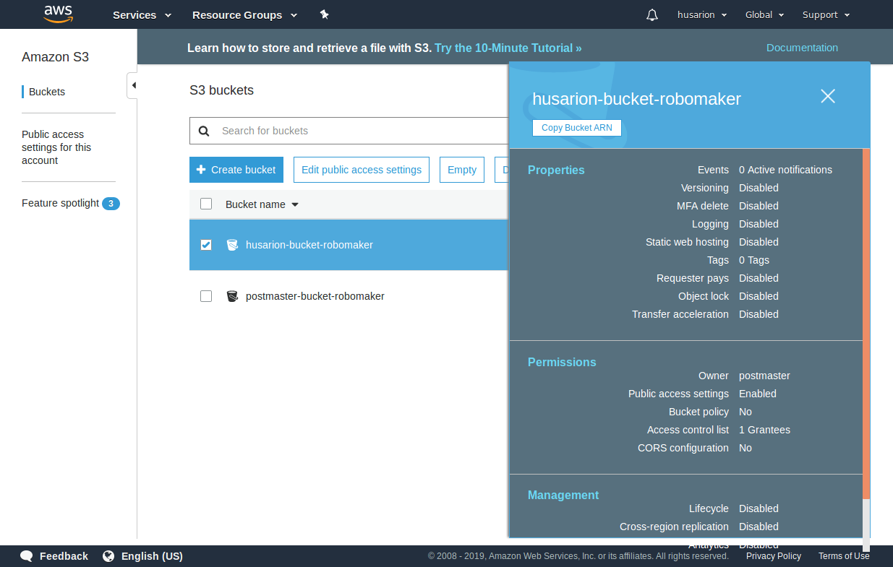

- Note the bucket name, you will need it later. We will refer to it as `<BUCKET_NAME>`.
- Click button **Copy bucket ARN**, this will copy bucket identifier to your clipboard. Paste it to text editor, it should be string similair to `arn:aws:s3:::husarion-bucket-robomaker`. We will refer to it as `<BUCKET_ARN>`.
- Close the S3 console

#### Creating an IAM role for RoboMaker instance

You will need an IAM role to allow RoboMaker interact with other AWS services. To create IAM role:
- sign in to [AWS IAM console](https://console.aws.amazon.com/iam/)


- On the left panel choose **Roles**


- Click **Create role**


- From **Select type of trusted entity** menu select **AWS Service**
- From **Choose the service that will use this role** menu choose **EC2** 
- Proceed with **Next: Permissions** button
- In **Attach permissions policies** dialog, add (You can use filter to search for them):
    - CloudWatchFullAccess
    - AWSRoboMakerFullAccess
    - AmazonS3FullAccess


- Proceed with **Next: Tags** and **Next: Review**.
    - In field **Role name** type `robomaker_role`.
    - In **Role description** type `Allows RoboMaker instances to call AWS services on your behalf.`.
    - Make sure that in **Policies** section you have three entries.

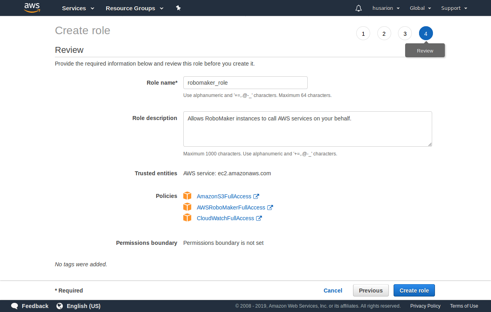

- Proceed with **Create role**, you will be redirected to **Roles** view.

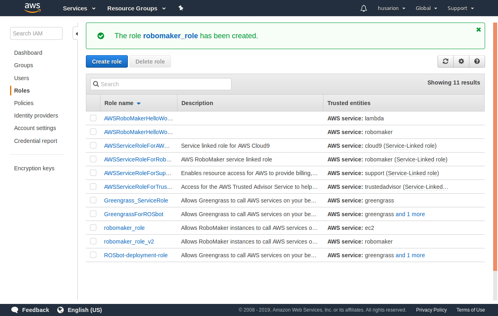

- Open role setting by clicking its name and choose tab **Trust relationships**. 


- Click button **Edit trust relationships** and edit policy document, find entry `ec2.amazonaws.com` and change it to `robomaker.amazonaws.com`.

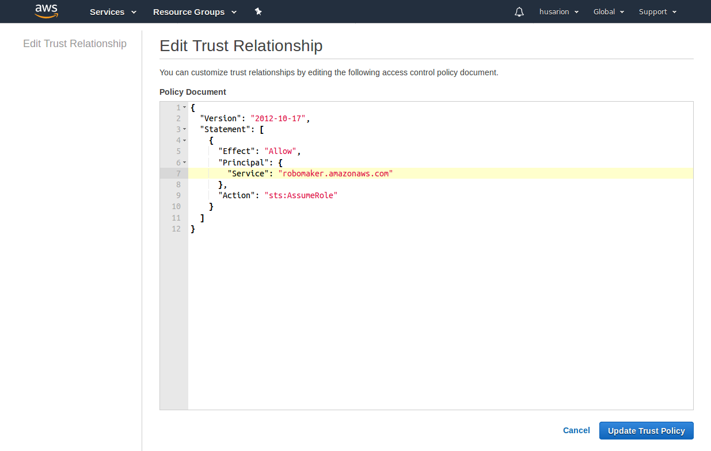

- Click **Update trust policy** button. 

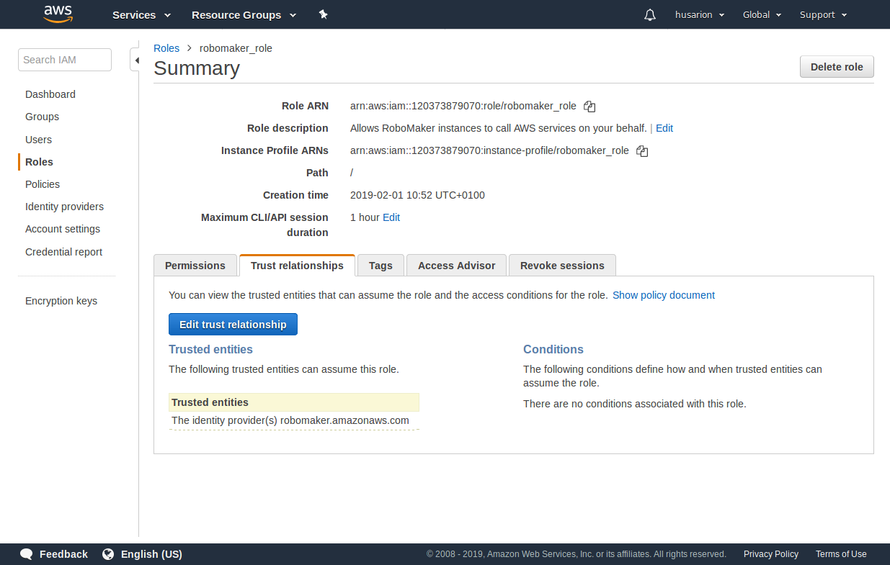

- Note the `Role ARN` entry, this will be required later. We will refer to it as `<IAM_ROLE_FOR_ROBOMAKER>`.

#### Creating an IAM role for application deployment

Greengrass will need an IAM role to interact with other AWS S3 service during deployment. To create the role:
- sign in to [AWS IAM console](https://console.aws.amazon.com/iam/)
- On the left, choose **Policies**, then choose **Create policy**.

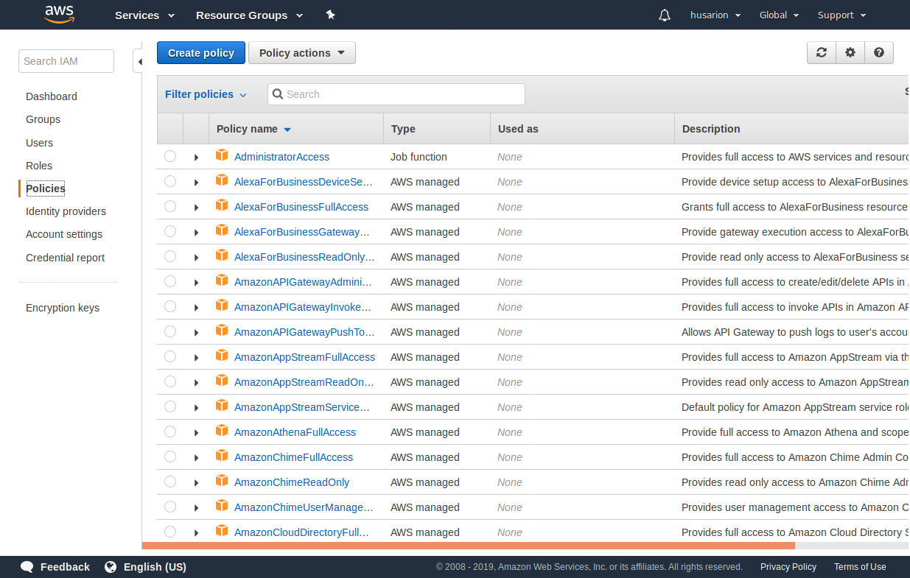

- Choose **JSON** tab and paste the code below. You will need to replace the `<BUCKET_ARN>` string with **ARN** of bucket that you created in first step:
```
{
    "Version": "2012-10-17",
    "Statement": [
        {
            "Effect": "Allow",
            "Action": [
                "robomaker:UpdateRobotDeployment"
            ],
            "Resource": "*"
        },
        {
            "Effect": "Allow",
            "Action": [
                "s3:List*",
                "s3:Get*"
            ],
            "Resource": ["<BUCKET_ARN>/*"]
        }
    ]
}
```

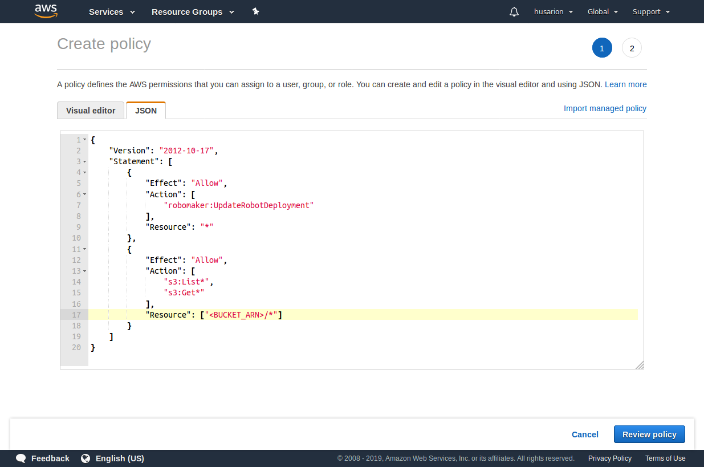

- Proceed with **Review policy**.
- In **Name** field type `ROSbot-deployment-policy`
- In **Description** field type `Allow GreenGrass to deploy RoboMaker apps to ROSbot.`

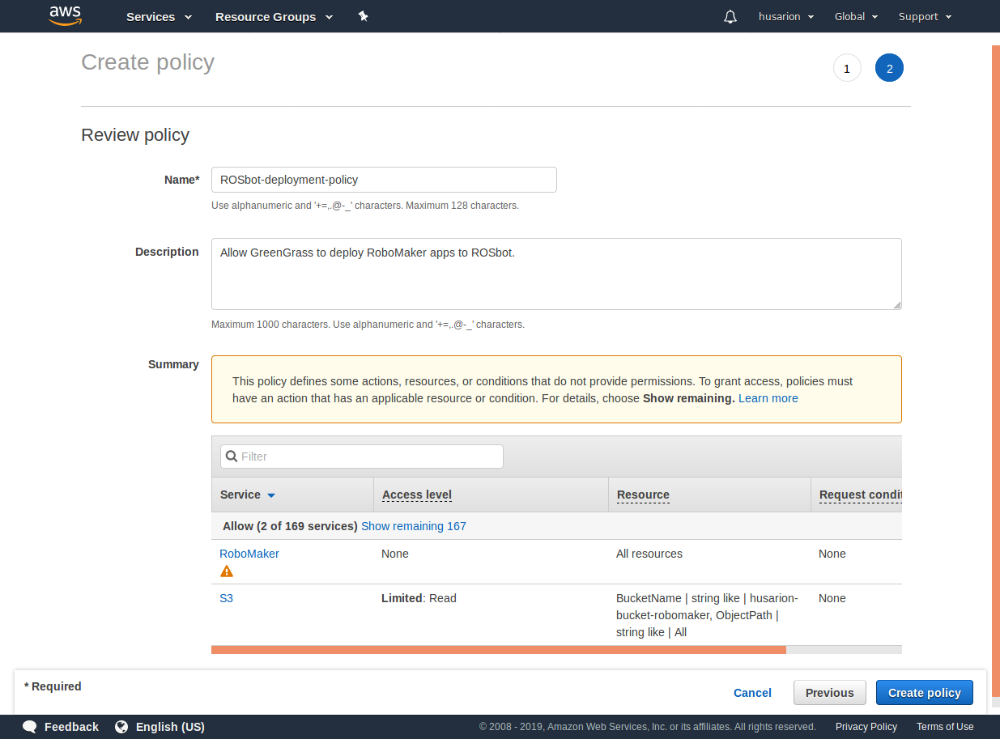

- Choose **Create policy**. You will be redirected to policies list.

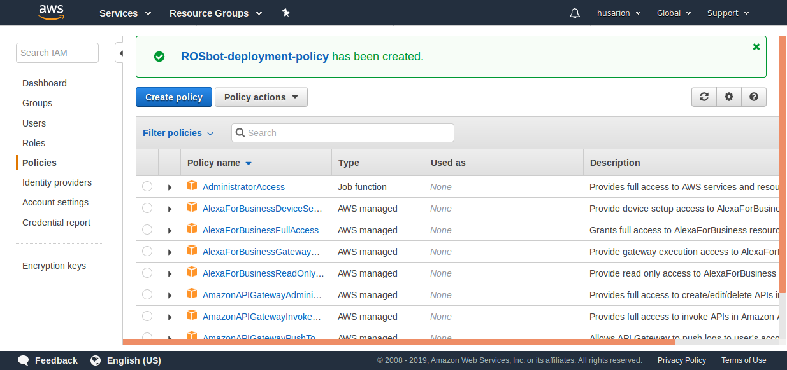

- From the left panel, choose **Roles** and then choose **Create role**.
- In **Choose the service that will use this role** list find **Greengrass** and then choose **Next: Permissions**.

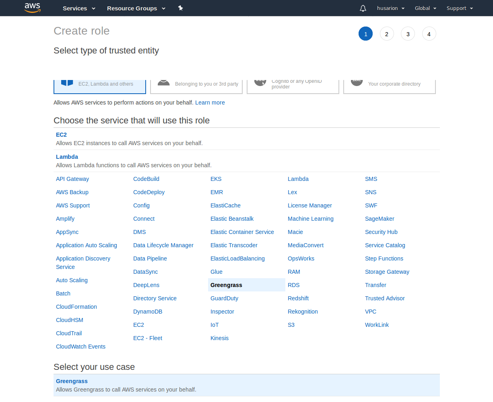

- In the **Permissions** page, select the policy `ROSbot-deployment-policy`. You can use filter to find it.

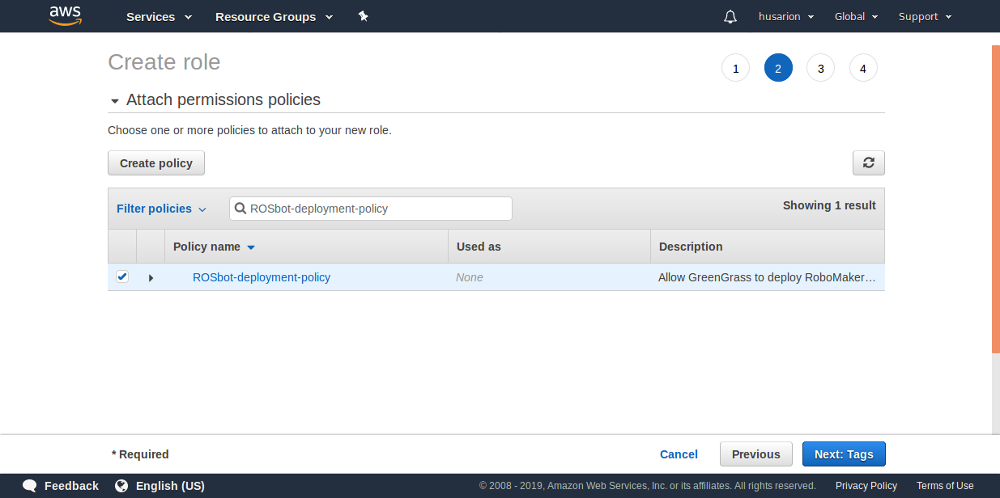

- Proceed with **Next: Tags** and **Next: Review**.
- In the **Review** page, type `ROSbot-deployment-role` in a **Role name** field.

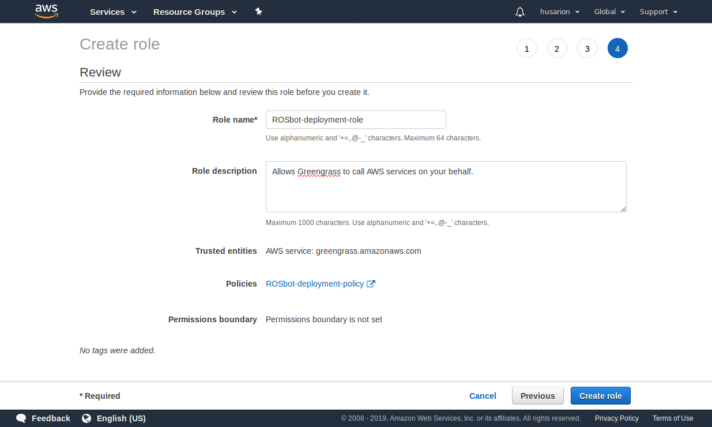

- Proceed with **Create role**.

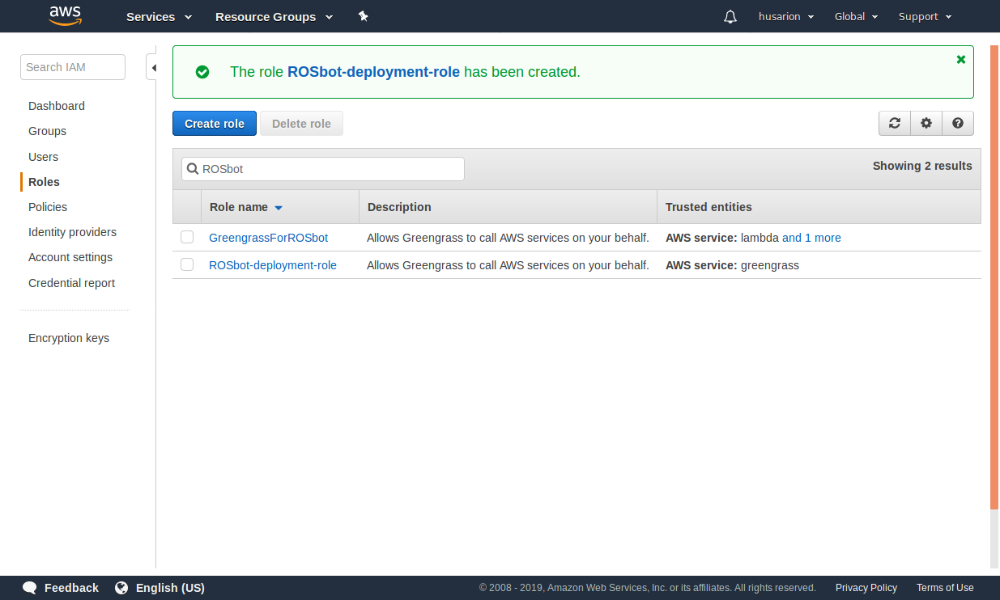

- Select the created role by clicking its name, then select the **Trust relationships** tab.

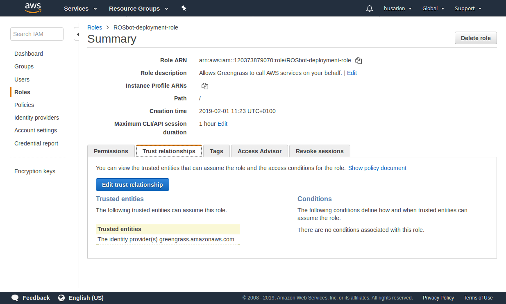

- Select **Edit trust relationship**.
- In **Policy document** field update with:
```
{
  "Version": "2012-10-17",
  "Statement": [
    {
      "Effect": "Allow",
      "Principal": {
        "Service": [
          "lambda.amazonaws.com",
          "greengrass.amazonaws.com"
        ]
      },
      "Action": "sts:AssumeRole"
    }
  ]
}
```

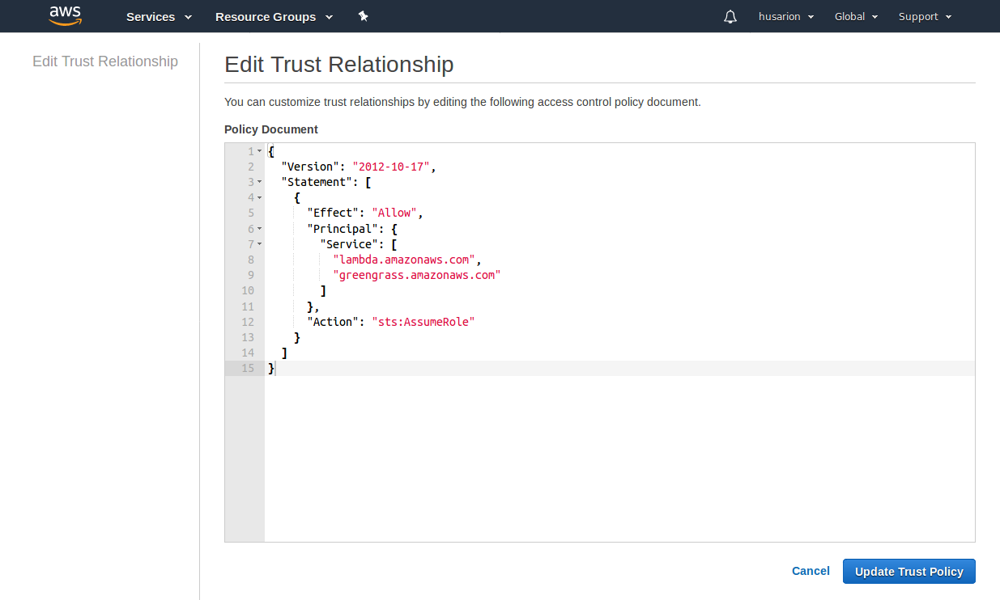

- Select **Update Trust Policy**.
- Close the IAM console

#### ROSbot setup in RoboMaker

ROSbot need some system modifications before Greengrass will be able to run and deploy applications. To configure ROSbot:
- sign in to the AWS RoboMaker [console](https://console.aws.amazon.com/robomaker/)
- In the left navigation pane, choose **Fleet Management** and then choose **Robots**.


- Choose **Create robot*.
- In the **Name** field, type `ROSbot`.
- From the **Architecture** dropdown menu choose **ARMHF**.
- From the **AWS Greengrass group** dropdown menu choose **Create new**.
- In the **AWS Greengrass prefix** field type `ROSbot`
- In the **IAM role** select **ROSbot-deployment-role**


- Proceed with **Create**, you will be redirected to **Download your Core device** page.

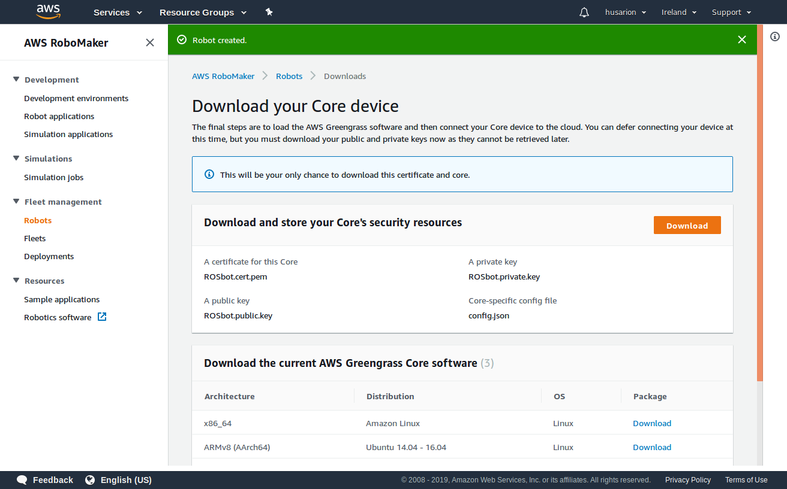


- Choose **Download** button next to **Download and store your Core's security resources**

- You will get `ROSbot-setup.zip` file, navigate to directory where it is downloaded, by default it should be `~/Downloads`

```
cd ~/Downloads
```

- Copy the file to your ROSbot:
```
scp ROSbot-setup.zip husarion@ROSBOT_IP:ROSbot-setup.zip
```

#### ROSbot setup on device 

You will need to make some system configurations on device, connect to your ROSbot through `ssh` or remote desktop and open terminal:

- Copy the `setup_ROSbot_for_gg.sh` file to your ROSbot and run it as root:

```
wget https://raw.githubusercontent.com/lukaszmitka/RoboMakerROSbotProject/master/setup_ROSbot_for_gg.sh
chmod a+x setup_ROSbot_for_gg.sh
sudo ./setup_ROSbot_for_gg.sh
```


- Unzip ROSbot security resources:

```
cd ~
sudo unzip ROSbot-setup.zip -d /greengrass
```

- Start the GreenGrass:
```
sudo /greengrass/ggc/core/greengrassd start
```
- Leave the ROSbot turned on, it will wait for deployment.

#### Creating a RoboMaker IDE

Application will be built using the RoboMaker environment. To create the IDE:
- sign in to the AWS RoboMaker [console](https://console.aws.amazon.com/robomaker/home).

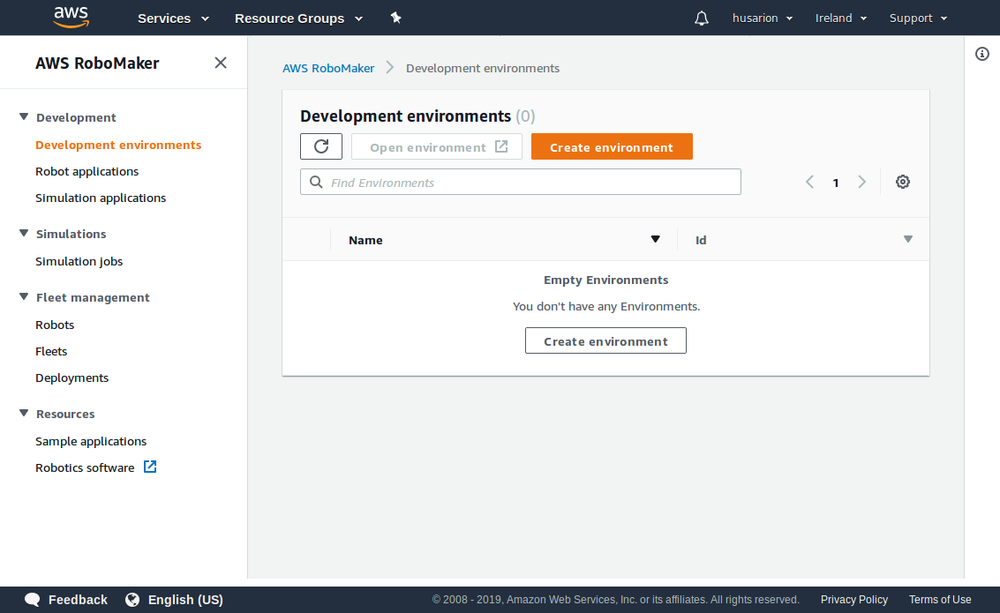

- On the left, expand **Development**, choose **Development environments**, and then choose **Create environment**.
- In the Create AWS RoboMaker development environment page, enter `rosbot_env` as the environment name.
- Accept the default Instance type (`m4.large`). You can select different instances type to improve bundling performance.
- In **VPC** dropdown list choose the default value.
- In the **Subnets** dropdown list choose the first subnet. You can select different subnet if necessary.

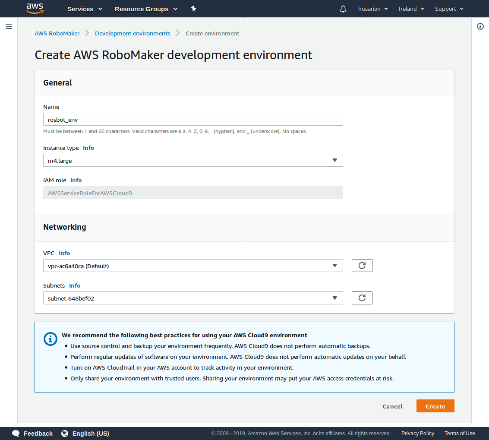

- Choose **Create** to create the AWS Cloud9 development environment.

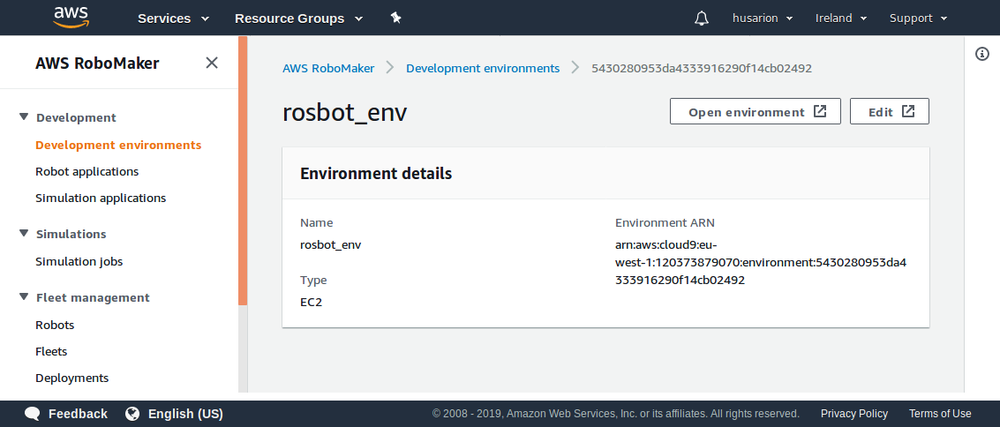


#### Deploying the application

To deploy application, you will use RoboMaker environment created in previous step:

- Go to AWS RoboMaker home [console](https://console.aws.amazon.com/robomaker/home).

- On the left, expand **Development**, choose **Development environments**, and then choose `rosbot_env`

- Open the development environmet with **Open environment** button.

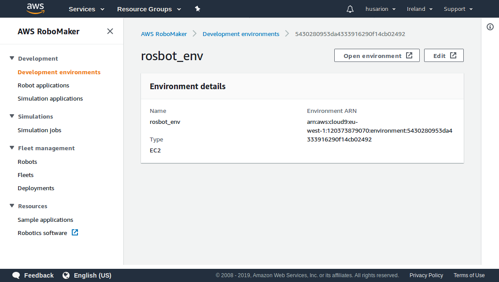

- In the IDE, go to bash tab and clone the `RoboMakerROSbotProject` repository in `~/environment/` directory:

```
cd ~/environment/
git clone --recurse-submodules https://github.com/lukaszmitka/RoboMakerROSbotProject.git
```


- Start the configuration script. You need to provide bucket name and ARN of IAM role that you created for RoboMaker instance:

```
cd ~/environment/RoboMakerROSbotProject/
./IDE_setup.bash <BUCKET_NAME> <IAM_ROLE_FOR_ROBOMAKER>
```

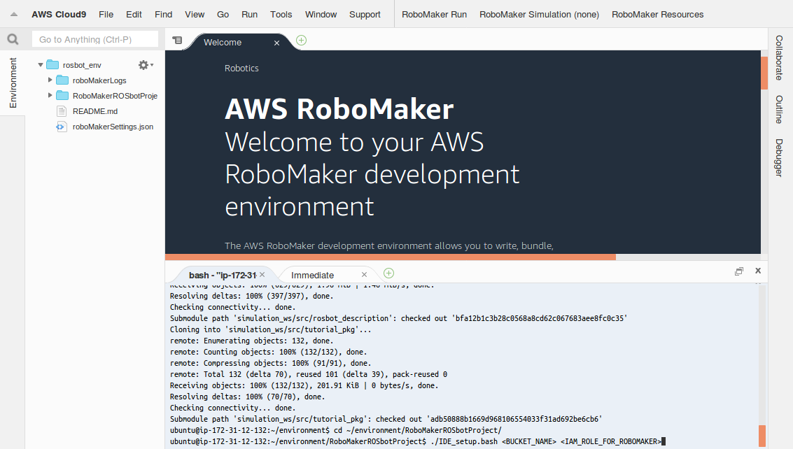

The script will install all dependencies, configure project, build and set the deployment job.